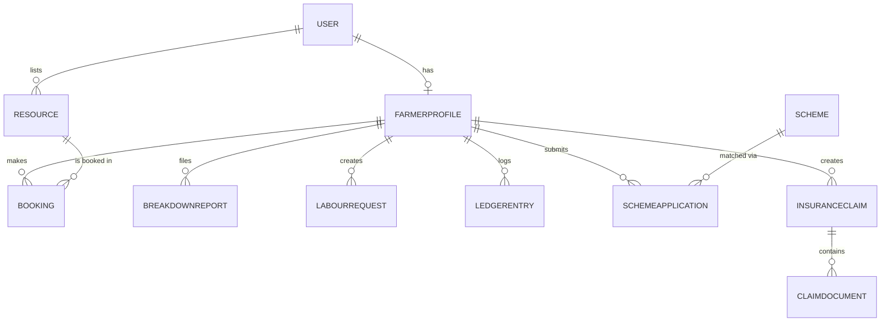

# Database Schema (Draft)

*Owner: Neha Bansal*

## Core Entities

- **User** — id, name, phone, email, password_hash, role (farmer /
  provider / admin), region, created_at
- **FarmerProfile** — user_id (FK), land_size, primary_crop, region
- **Resource** — id, provider_id (FK), type (tractor / harvester / pump /
  rotavator / trailer), availability_window, usage_charge, location
- **Booking** — id, resource_id (FK), farmer_id (FK), status (pending /
  accepted / rejected / completed), start_time, end_time, is_group_booking
- **BreakdownReport** — id, farmer_id (FK), equipment_type, description,
  location, status, created_at
- **LabourRequest** — id, farmer_id (FK), work_type, workers_needed,
  date, duration, location, status
- **LedgerEntry** — id, farmer_id (FK), type (expense / revenue),
  category (seeds / fertilizer / labour / fuel / machinery /
  transport), amount, crop_cycle, date
- **Scheme** — id, name, eligibility_rules (JSON), required_documents
- **SchemeApplication** — id, farmer_id (FK), scheme_id (FK), status
- **InsuranceClaim** — id, farmer_id (FK), crop, incident_date, location,
  damage_description, status
- **ClaimDocument** — id, claim_id (FK), file_url, uploaded_at

## Relationships (high level)

## Notes
- Target normal form: 3NF
- Storage split: PostgreSQL for structured relational data; Supabase
  Storage for claim documents/photographs
- Finalized schema + migration scripts are a **Week 2** deliverable
